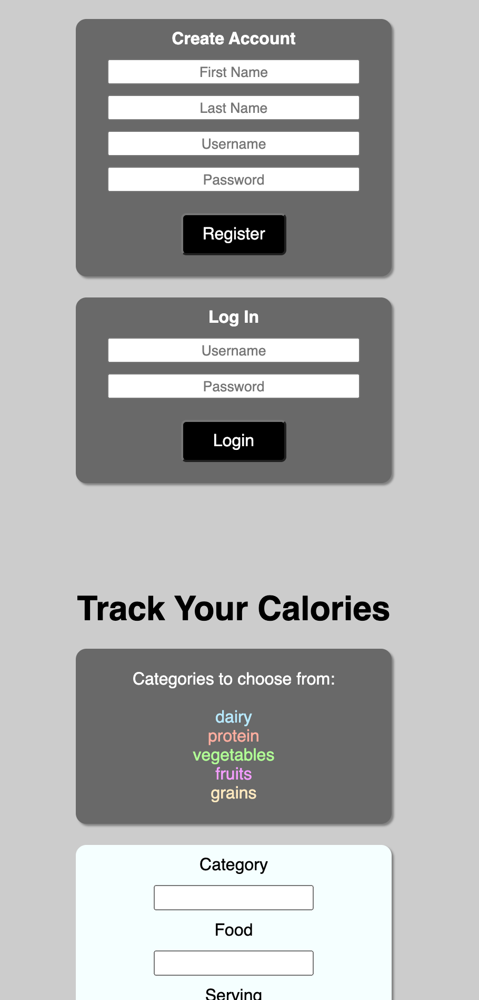

#Authenication & Authorization

This web app uses the passport library to handle authenication and authorization of
users when they sign upor log into the web app. the bcrypt library is also used to 
hash passwords and keep them secure in the MonngoDB database. Once logged in users 
can keep track and manage thier own calories.



## Resource

**Intake**

Attributes:

* category (string)
* food (string)
* serving (integer)
* calories (integer)

**User**

Attributes:

* email (string)
* firstName (string)
* lastName (string)
* encryptedPassword (string)

## Schema

```mongodb
Intake ({
category: STRING,
food: STRING,
serving: NUMBER,
calories: NUMBER,
user: mongoose.Schema.Types.ObjectID});
User ({
email: String,
firstName: String,
lastName: String,
encryptedPassword: String})
})
```

## REST Endpoints

Name                           | Method | Path
-------------------------------|--------|------------------
Retrieve intake collection     | GET    | /intakes
Retrieve intake member         | GET    | /intakes/*\<id\>*
Create intake member           | POST   | /intakes
Update intake member           | PUT    | /intakes/*\<id\>*
Delete intake member           | DELETE | /intakes/*\<id\>*
Create User                    | POST   | /users
Login User                     | POST   | /session

## Heroku Link

https://powerful-beyond-38748.herokuapp.com/
